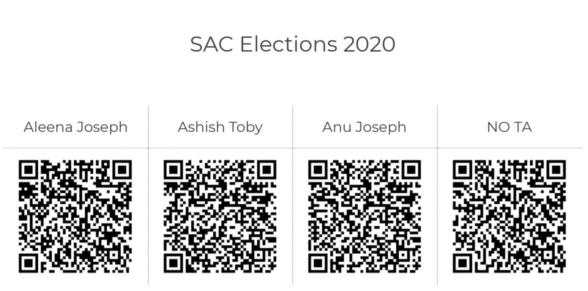

# QR_attendance
Scan QR code to mark your attendance/ vote for an election. Make teachers'/ Electorers' job easy!

https://docs.google.com/spreadsheets/d/1dBrwKDnENartgKOMo0L730-ivrQnBzMRx7ne46Sag6o

Made with [Google Sheets](http://sheets.google.com/) and [Google QR Code API](https://developers.google.com/chart/infographics/docs/qr_codes)

